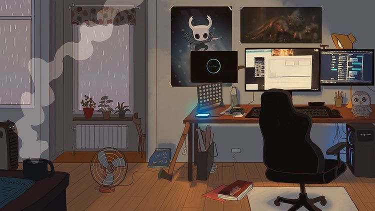
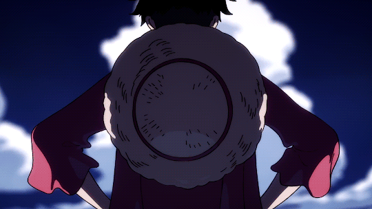

<h2 align="center">Hi there, I'm Ivan ( ´ ▽ ` )ﾉ</h2>

<p align="center">
  <em>React Native Engineer · 5+ years of building mobile apps · Moscow</em>
</p>

```typescript
const Ivan: Record<FieldType, string> = {
  role: "React Native Engineer",
  experience: "5+ years of developing mobile apps",
  languages: ["TypeScript", "JavaScript", "Python"],
  mobile: ["React Native", "Reanimated", "Redux Toolkit", "GraphQL", "MobX", "Native modules"],
  shipping: ["Fastlane", "GitLab CI/CD", "Maestro E2E", "Jest"],
  web: ["React", "Vue", "Angular", "Gatsby"],
  backend: ["Django", "PostgreSQL", "Docker"],
  learning: ["FastAPI"],
  education: "BSc, Web Technologies · 2019–2023, Moscow",
  agents: "Can help set up a spec-driven-development workflow",
  motto: "Still love writing code by hand, even in the age of agentic coding",
};
```

### A little more about me...

<table>
<tr>
<td valign="top">

<div><b>What I'm currently doing:</b></div>

- Searching for a new and fun job!
- Working on my personal projects (finally, I have some time to work on my own stuff!):
  - Questeria — an app for task/goals management using quest-like interface, featuring quests boards, XP, sketching using PencilKit and offline-first database with server sync. Stack: React Native, nitro modules, python's fastAPI, PostgreSQL.
  - Stow — an app for managing your belongings using game-like pixel interface. Inspired by games — in games organization makes it so much more satisfying to organize your stuff. So, as a minimalist, I wanted to have something like this in real life to actually keep track of what you own. Stack: React Native, nitro modules (for something interesting) and python's fastAPI, PostgreSQL.
  - face_control — a simple utility to help me stay productive while also helping me to keep correct posture. Using python, MediaPipe, QT6
- Practicing Leetcode (it's a privilege to suck at something and then get better at it)

</td>
<td width="340" align="center" valign="middle">

</td>
</tr>
</table>

<table>
<tr>
<td width="340" align="center" valign="middle">

</td>
<td valign="top">

<div><b>What I like:</b></div>

- **Gaming:** my favorite games are *Hollow Knight*, *Stardew Valley*, and *Monster Hunter*
- **Photography:** I love taking photos of nature and people. I also share my photos online (check my unsplash if you wish to see them)
- **Anime:** my favorites are *One Piece* and *Vinland Saga*
- **Writing:** I write quite often, but I keep it to myself (maybe one day I'll share it with others)
- **Coffee:** I make my own coffee, and I can't live without it
- **Nature:** I enjoy my morning walks and runs in nature
- **Books:** my favorites are *The Book Thief* and *The Lord of the Rings*

</td>
</tr>
<tr>
<td colspan="2">

I also love reading and discussing recent tech news: new libraries, products, models, etc. Feel free to connect if you want to chat and keep up with tech trends together (╹◡╹)♡

</td>
</tr>
</table>

<p align="center">
  
</p>

---

<p align="center">
  <strong><a href="https://vahn-gh.github.io/">Portfolio</a></strong> |
  <strong><a href="https://t.me/vahn_tg">Telegram</a></strong> |
  <strong><a href="https://www.linkedin.com/in/ivan-yurkin-187039220">LinkedIn</a></strong> |
  <strong><a href="https://www.instagram.com/yuru.in/">Instagram</a></strong> |
  <strong><a href="https://unsplash.com/@yuru_in">Unsplash</a></strong>
</p>
